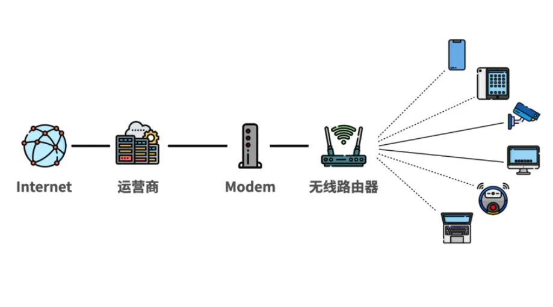

## 项目概述

- **猫点饭 NAT 在线检测工具** 支持浏览器即时探测 NAT1~NAT4，页面直接解读网络连通性与优化建议。
- NAT（网络地址转换）是家庭宽带共享公网的重要机制，不同类型会直接影响主机联机、P2P 下载、远程访问与实时通信体验。

## 检测与验证流程

1. 打开检测页（https://mao.fan/mynat），点击“检测 NAT 类型”。
2. 若结果为 NAT3/NAT4，可再使用 pystun3、NatTypeTester 等工具做交叉验证。
3. 不同平台无需安装任何客户端，直接通过浏览器即可访问。

## NAT 类型速览

**NAT 四种类型：**

- **Full Cone NAT（全锥形）**：任何外部主机只要知道这个公网 IP 和端口，就能向内网主机发送数据。
- **Restricted Cone NAT（受限锥形）**：内网主机需先向外部主机发送数据，该外部主机才能向内网主机发送数据。
- **Port Restricted Cone NAT（端口受限锥形）**：内网主机需先向外部主机发送数据，该外部主机的特定端口才能向内网主机发送数据。
- **Symmetric NAT（对称形）**：内网主机与每个外部主机通信时，会分配不同的公网 IP 和端口，在安全性上最为严格，但也最容易导致连接问题。

## NAT3 / NAT4 影响详解

- **在线游戏与主机联机**：NAT3 配对范围受限，需要与 NAT1/NAT2/NAT3 玩家配合打洞才能稳定联机；NAT4 匹配窗口极小，常常等待超时。[来源](https://easytier.rs/guide/network/p2p-optimize.html)
- **P2P / BT / CDN**：NAT3 成功打洞后性能接近 NAT1，但连接建立难度更高，若对端类型不友好仍会失败；NAT4 几乎无法完成打洞，只能依赖中继或被动模式。[来源](https://easytier.rs/guide/network/p2p-optimize.html)
- **内网穿透与打洞**：NAT3 需要借助 STUN/ICE 等协议配合友好节点才能建立会话；NAT4 对每个目标动态改写端口，常规打洞几乎不成功，ZeroTier、FRP 等工具只能回落到中继通道。[来源](https://easytier.rs/guide/network/p2p-optimize.html)
- **视频会议 / 实时通话**：NAT3 可能因打洞失败部分回落到 TURN 中继；NAT4 基本无法直连，延迟、画面冻结与呼叫失败更为常见。[来源](https://easytier.rs/guide/network/p2p-optimize.html)

## 如何优化NAT类型？

- 调整光猫桥接、更新路由器固件（支持 Full Cone）、开启 UPnP/端口映射、放行 UDP 规则，逐步消除多级 NAT。
- 进阶用户可在OpenWrt路由器上启用 fullcone 模块，或借助第三方网络加速、旁路由方案、FRP 等工具改善对称 NAT 的限制。

